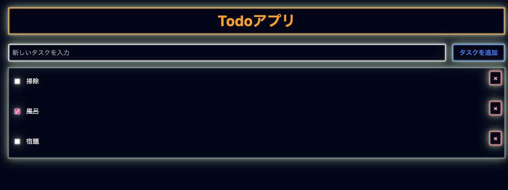

# T3 Todo TailwindCSS And App Router

IT Media連載記事[フルスタックフレームワーク、T3 Stack入門](https://atmarkit.itmedia.co.jp/ait/series/34783/)の連載第三回目の掲載サンプルコードです。

- [連載 第一回 TypeScriptベースのフルスタックフレームワーク「T3 Stack」で極上の開発体験を　何がすごいのか？](https://atmarkit.itmedia.co.jp/ait/articles/2304/28/news207.html)
- [連載 第二回 T3 Stackの要、tRPCとは？　tRPC、Zod、TanStack Queryについて解説](https://atmarkit.itmedia.co.jp/ait/articles/2307/03/news012.html)
- [連載 第三回 T3 Stackに新たなORMの選択肢Drizzleが登場、Prismaよりも先鋭的？](https://atmarkit.itmedia.co.jp/ait/articles/2312/07/news007.html)
- [連載 第四回 T3 ユーティリティーファーストなCSSフレームワーク「Tailwind CSS」のメリットとデメリットの克服方法](https://atmarkit.itmedia.co.jp/ait/articles/2312/07/news011.html)
- (予定) 連載 第五回 結局のところ、T3 Stackを採用するメリットとは何なのか?

## 実行手順

```
> cd t3-todo-app-router
> npm install
> npm run db:push
> npm run dev
# http://localhost:3000/にアクセス

```

## OpenAPI Sample

以下でREST呼び出しが可能です。

```
curl -X GET -H 'Content-Type: application/json' 'http://localhost:3000/api/todo'
curl -X POST -H 'Content-Type: application/json' 'http://localhost:3000/api/todo' -d '{"done":false,"text":"test1"}'
curl -X POST -H 'Content-Type: application/json' 'http://localhost:3000/api/todo' -d '{"done":false,"text":"test2"}'
curl -X PUT -H 'Content-Type: application/json' 'http://localhost:3000/api/todo/cm43zhjey00013h2bzkeb122c' -d '{"done":true, "text": "updated"}'
curl -X DELETE -H 'Content-Type: application/json' 'http://localhost:3000/api/todo/cm43zhjey00013h2bzkeb122c'
curl -X GET -H 'Content-Type: application/json' 'http://localhost:3000/api/todo'
```

##  Swagger UI

以下のURLでSwagger UIが表示できます。

http://localhost:3000/openapi

以下のURLでOpenAIのjsonが取得できます。

http://localhost:3000/api/openapi.json


# GitHub Repositories and Branches

- [t3-todo / Pages Router](https://github.com/uehaj/t3-todo)
- [t3-todo / App Router](https://github.com/uehaj/t3-todo-app-router)
- [t3-todo / App Router with Server Actions](https://github.com/uehaj/t3-todo-app-router/tree/server_actions)
- [t3-todo / AppRouter with trpc-to-openapi](https://github.com/uehaj/t3-todo-app-router/tree/trpc-to-openapi)

# Screen Shot


